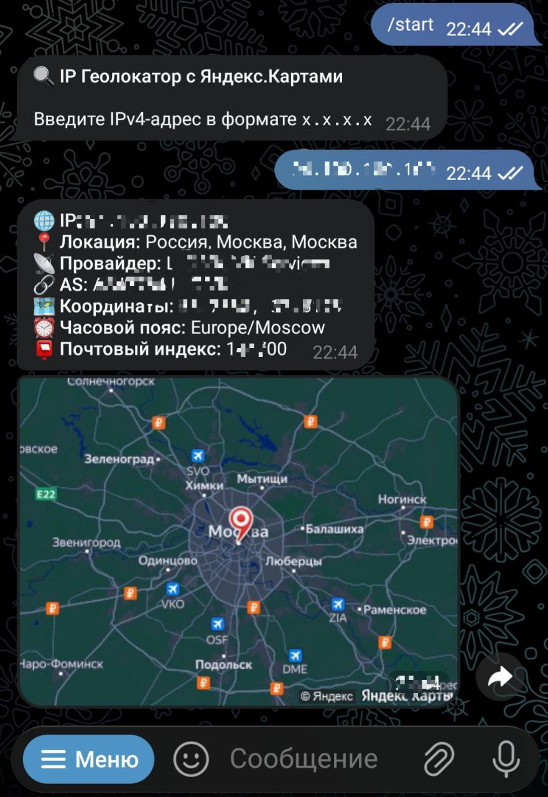

# 🤖 IP Геолокатор для Telegram

[](https://www.python.org/)
[](https://core.telegram.org/bots)
[](LICENSE)

**Telegram бот для получения геолокации по IPv4 адресу с картой Яндекс.Карты**

## ✨ **Демо**


*Введите IP → Получите локацию + карту*

## 🚀 **Функции**

- ✅ **Валидация IPv4** адресов
- 🌐 **ip-api.com** — бесплатная геолокация
- 🗺️ **Яндекс.Карты Static API** — красный маркер на карте
- 💎 **Markdown** форматирование
- 🛡️ **Обработка ошибок** + fallback
- ⚡ **Асинхронный** `python-telegram-bot v20+`

## 🛠️ **Установка**

```bash
# Клонировать репозиторий
git clone git@github.com:zheskod/findip.git
cd findip

# Создать виртуальное окружение
python -m venv venv
source venv/bin/activate  # Linux/Mac
# venv\Scripts\activate   # Windows

# Установить зависимости
pip install -r requirements.txt

⚙️ Конфигурация
    Скопируй токен и замени в main.py:
    BOT_TOKEN = "YOUR_BOT_TOKEN_HERE"
    
    Яндекс.Карты ключ (опционально):
    YANDEX_MAPS_KEY = "your_yandex_key_here"

▶️ Запуск

bash
python main.py

Бот готов! 
Отправь /start в Telegram.

🔧 Настройки Яндекс.Карты
    Zoom: 9 (глобальный вид)
    Размер: 400x300
    Маркер: pm2rdm (красный круг)
    Тема: dark (тёмная карта)

⚠️ Лимиты сервисов
| Сервис       | Лимит      | Статус          |
| ------------ | ---------- | --------------- |
| ip-api.com   | 45 req/мин | ✅ Бесплатно    |
| Яндекс.Карты | По тарифу  | 🔑 Требует ключ |


⭐ Поставь звезду, если бот понравился!
